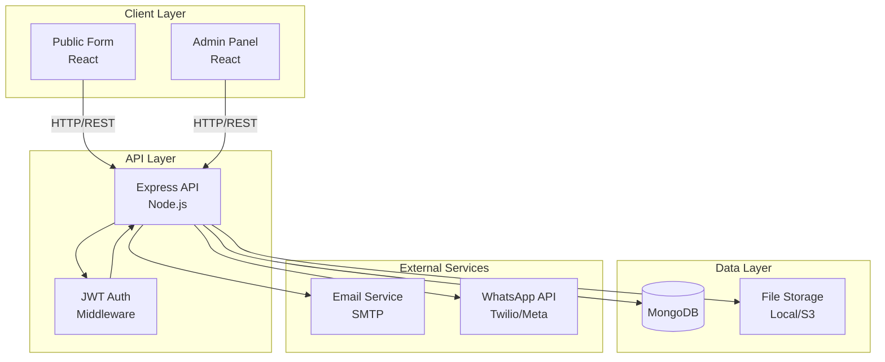
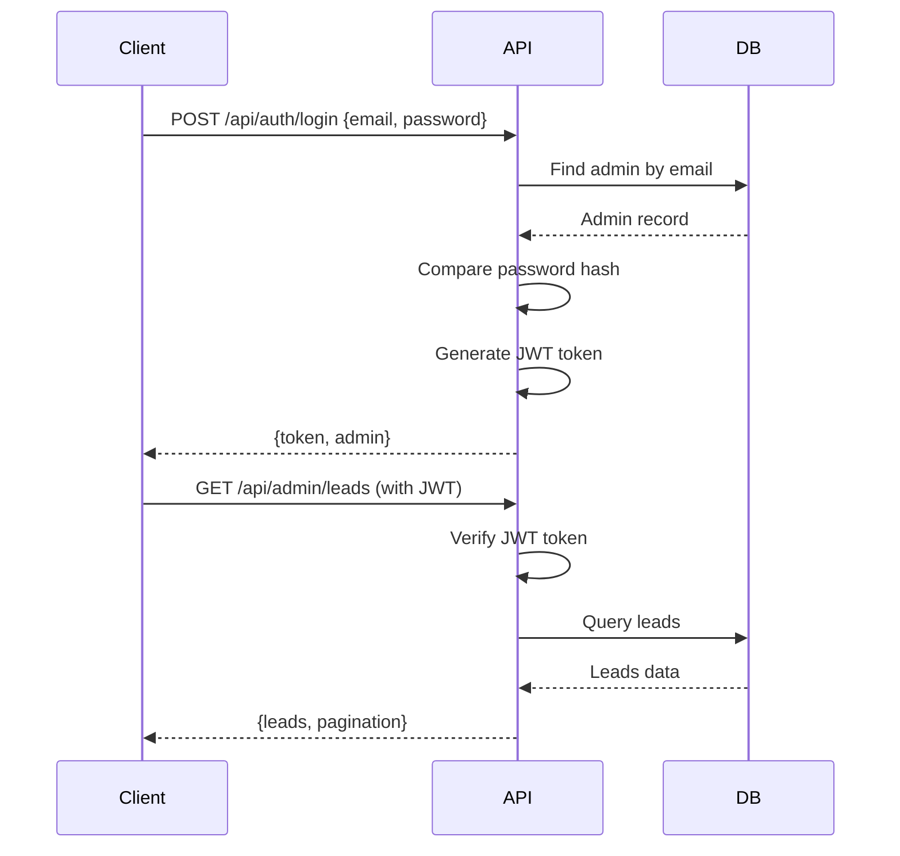
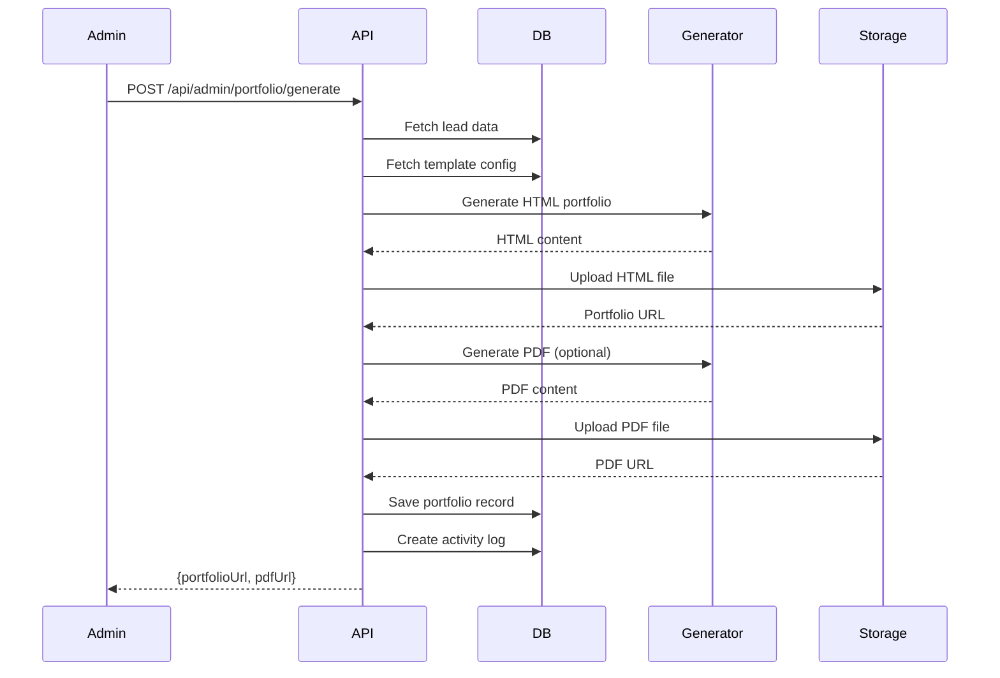

# Design Document: Portfolio Builder System

## Overview

The Portfolio Builder System is a full-stack web application consisting of:
- **Public Frontend**: React-based lead submission form
- **Admin Frontend**: React-based admin panel for lead management
- **Backend API**: Node.js/Express REST API
- **Database**: MongoDB for data persistence
- **File Storage**: Local filesystem (dev) or cloud storage (prod)
- **External Services**: SMTP for email, WhatsApp API for messaging

The system follows a client-server architecture with JWT-based authentication for admin access and RESTful API design patterns.

## Architecture

### High-Level Architecture



### Technology Stack

**Frontend:**
- React 18 with Vite for fast development
- React Router v6 for routing
- TailwindCSS for styling
- Axios for HTTP requests
- React Hook Form + Zod for form validation
- React Query for server state management

**Backend:**
- Node.js 18+ with Express 4.x
- MongoDB 6+ with Mongoose ODM
- JWT (jsonwebtoken) for authentication
- Multer for file upload handling
- Nodemailer for email sending
- Twilio SDK or Meta WhatsApp Cloud API for WhatsApp

**Infrastructure:**
- Development: Local file storage
- Production: AWS S3, Cloudinary, or Google Cloud Storage
- Environment variables for configuration

## Components and Interfaces

### Frontend Components

#### Public Form Component Structure

```
PublicForm/
├── LeadForm.jsx          # Main form component
├── FileUpload.jsx        # Resume upload component
├── FormField.jsx         # Reusable input field
├── SuccessMessage.jsx    # Thank you message
└── validationSchema.js   # Zod validation schema
```

**LeadForm Component:**
- Manages form state using React Hook Form
- Validates input using Zod schema
- Handles file upload with progress indication
- Submits data to POST /api/leads endpoint
- Displays success message with tracking ID

**FileUpload Component:**
- Accepts PDF, DOC, DOCX files only
- Validates file size (max 10MB)
- Shows upload progress
- Displays file preview/name

#### Admin Panel Component Structure

```
AdminPanel/
├── Auth/
│   ├── Login.jsx         # Login page
│   └── ProtectedRoute.jsx # Route guard
├── Dashboard/
│   └── Dashboard.jsx     # Statistics dashboard
├── Leads/
│   ├── LeadsList.jsx     # Leads table with filters
│   ├── LeadDetail.jsx    # Lead detail view
│   ├── StatusBadge.jsx   # Status display component
│   └── NotesSection.jsx  # Notes management
├── Templates/
│   ├── TemplatesList.jsx # Templates management
│   └── TemplateForm.jsx  # Template create/edit
├── Portfolio/
│   ├── GenerateButton.jsx # Portfolio generation
│   └── SendButtons.jsx    # Email/WhatsApp sending
└── Layout/
    ├── Sidebar.jsx       # Navigation sidebar
    └── Header.jsx        # Top header with user info
```

**LeadsList Component:**
- Displays paginated table of leads
- Implements status filter dropdown
- Implements search input with debouncing
- Navigates to lead detail on row click

**LeadDetail Component:**
- Displays all lead information
- Shows resume download/view button
- Manages notes with add/display functionality
- Provides status update dropdown
- Shows portfolio generation and sending options
- Displays activity log

### Backend API Structure

#### API Routes

```
/api
├── /leads
│   ├── POST /              # Create lead (public)
│   └── GET /track/:id      # Track lead status (public)
├── /auth
│   ├── POST /login         # Admin login
│   └── GET /me             # Get current admin
├── /admin
│   ├── /leads
│   │   ├── GET /           # List leads with filters
│   │   ├── GET /:id        # Get lead details
│   │   └── PATCH /:id      # Update lead
│   ├── /templates
│   │   ├── GET /           # List templates
│   │   ├── POST /          # Create template
│   │   └── PATCH /:id      # Update template
│   ├── /portfolio
│   │   ├── POST /generate  # Generate portfolio
│   │   └── POST /send      # Send portfolio
│   └── /export
│       └── GET /leads      # Export leads to CSV
```

#### Middleware Stack

```javascript
// Middleware order
app.use(cors(corsOptions))
app.use(express.json())
app.use(express.urlencoded({ extended: true }))
app.use(rateLimiter)        // Rate limiting
app.use(requestLogger)      // Request logging
app.use('/api/admin', authMiddleware)  // JWT validation
app.use(errorHandler)       // Global error handler
```

### Data Models

#### Lead Model

```javascript
{
  name: String (required, trimmed),
  email: String (required, lowercase, validated),
  phone: String (required, validated),
  role: String (required),
  experienceYears: Number (required, min: 0),
  city: String (required),
  budget: Number (optional),
  message: String (optional),
  resumeUrl: String (required),
  resumePath: String (required),
  status: Enum ['NEW', 'IN_PROGRESS', 'COMPLETED', 'REJECTED'] (default: 'NEW'),
  assignedTo: ObjectId (ref: 'Admin', optional),
  notes: [{
    text: String (required),
    addedBy: ObjectId (ref: 'Admin'),
    addedAt: Date (default: Date.now)
  }],
  source: String (default: 'Direct'),
  trackingId: String (unique, auto-generated),
  createdAt: Date (auto),
  updatedAt: Date (auto)
}
```

**Indexes:**
- `email` (unique)
- `status` (for filtering)
- `trackingId` (unique, for public tracking)
- `createdAt` (for sorting)

#### Portfolio Model

```javascript
{
  leadId: ObjectId (ref: 'Lead', required),
  templateId: ObjectId (ref: 'Template', required),
  portfolioUrl: String (required),
  pdfUrl: String (optional),
  sentOnEmail: Boolean (default: false),
  sentOnWhatsApp: Boolean (default: false),
  sentAt: Date (optional),
  createdAt: Date (auto),
  updatedAt: Date (auto)
}
```

**Indexes:**
- `leadId` (for lookup)

#### Template Model

```javascript
{
  name: String (required, unique),
  description: String (optional),
  config: Object (required) {
    layout: String,
    colorScheme: Object,
    sections: Array,
    customCSS: String (optional)
  },
  previewUrl: String (optional),
  isActive: Boolean (default: true),
  createdAt: Date (auto),
  updatedAt: Date (auto)
}
```

#### Admin Model

```javascript
{
  email: String (required, unique, lowercase),
  password: String (required, hashed),
  name: String (required),
  role: Enum ['ADMIN', 'DESIGNER'] (default: 'ADMIN'),
  isActive: Boolean (default: true),
  lastLogin: Date (optional),
  createdAt: Date (auto),
  updatedAt: Date (auto)
}
```

**Indexes:**
- `email` (unique)

#### ActivityLog Model

```javascript
{
  leadId: ObjectId (ref: 'Lead', required),
  action: Enum ['STATUS_CHANGED', 'NOTE_ADDED', 'PORTFOLIO_SENT', 'PORTFOLIO_GENERATED'] (required),
  byAdminId: ObjectId (ref: 'Admin', required),
  meta: Object (optional) {
    oldStatus: String,
    newStatus: String,
    sentVia: String,
    templateId: ObjectId
  },
  createdAt: Date (auto)
}
```

**Indexes:**
- `leadId` (for filtering)
- `createdAt` (for sorting)

### API Endpoint Specifications

#### POST /api/leads

**Request:**
```javascript
Content-Type: multipart/form-data

{
  name: string,
  email: string,
  phone: string,
  role: string,
  experienceYears: number,
  city: string,
  budget: number (optional),
  message: string (optional),
  resume: File,
  source: string (optional, from UTM params)
}
```

**Response (201):**
```javascript
{
  success: true,
  data: {
    trackingId: string,
    message: string
  }
}
```

**Validation:**
- Email format validation
- Phone format validation
- File type validation (PDF, DOC, DOCX)
- File size validation (max 10MB)
- Required fields presence

#### POST /api/auth/login

**Request:**
```javascript
{
  email: string,
  password: string
}
```

**Response (200):**
```javascript
{
  success: true,
  data: {
    token: string,
    admin: {
      id: string,
      email: string,
      name: string,
      role: string
    }
  }
}
```

#### GET /api/admin/leads

**Query Parameters:**
- `status`: string (NEW, IN_PROGRESS, COMPLETED, REJECTED)
- `search`: string (searches name, email, role)
- `page`: number (default: 1)
- `limit`: number (default: 20)
- `sortBy`: string (default: 'createdAt')
- `sortOrder`: string (asc, desc, default: 'desc')

**Response (200):**
```javascript
{
  success: true,
  data: {
    leads: Array<Lead>,
    pagination: {
      total: number,
      page: number,
      limit: number,
      pages: number
    }
  }
}
```

#### GET /api/admin/leads/:id

**Response (200):**
```javascript
{
  success: true,
  data: {
    lead: Lead (with populated notes and assignedTo),
    portfolio: Portfolio (if exists),
    activityLog: Array<ActivityLog>
  }
}
```

#### PATCH /api/admin/leads/:id

**Request:**
```javascript
{
  status: string (optional),
  notes: string (optional, adds new note),
  assignedTo: string (optional, admin ID)
}
```

**Response (200):**
```javascript
{
  success: true,
  data: {
    lead: Lead (updated)
  }
}
```

**Business Logic:**
- Validate status transitions
- Create activity log entry for status changes
- Create activity log entry for note additions
- Update timestamps

#### POST /api/admin/portfolio/generate

**Request:**
```javascript
{
  leadId: string,
  templateId: string
}
```

**Response (200):**
```javascript
{
  success: true,
  data: {
    portfolioUrl: string,
    pdfUrl: string (optional)
  }
}
```

**Process:**
1. Fetch lead data
2. Fetch template configuration
3. Generate HTML portfolio using template
4. Host portfolio (static file or cloud)
5. Optionally generate PDF using puppeteer
6. Save portfolio record
7. Create activity log entry

#### POST /api/admin/portfolio/send

**Request:**
```javascript
{
  leadId: string,
  via: string ('EMAIL' or 'WHATSAPP'),
  portfolioUrl: string,
  pdfUrl: string (optional)
}
```

**Response (200):**
```javascript
{
  success: true,
  data: {
    sent: boolean,
    sentAt: Date
  }
}
```

**Process:**
- If via EMAIL: Use Nodemailer to send email with portfolio link and optional PDF attachment
- If via WHATSAPP: Use Twilio/Meta API to send message with portfolio link
- Update portfolio record with sent status
- Create activity log entry

### File Storage Service

#### Interface

```javascript
class FileStorageService {
  async uploadFile(file, folder)
  async getFileUrl(filePath)
  async deleteFile(filePath)
  async downloadFile(filePath)
}
```

#### Implementation Strategy

**Development Environment:**
```javascript
class LocalFileStorage implements FileStorageService {
  uploadFile(file, folder) {
    // Save to ./uploads/{folder}/{uniqueFilename}
    // Return relative path
  }
  
  getFileUrl(filePath) {
    // Return /uploads/{filePath}
  }
}
```

**Production Environment:**
```javascript
class S3FileStorage implements FileStorageService {
  uploadFile(file, folder) {
    // Upload to S3 bucket
    // Return S3 URL
  }
  
  getFileUrl(filePath) {
    // Return signed URL or public URL
  }
}
```

### Email Service

#### Configuration

```javascript
{
  service: 'gmail' | 'smtp',
  host: string,
  port: number,
  secure: boolean,
  auth: {
    user: string,
    pass: string
  }
}
```

#### Email Templates

**Portfolio Ready Email:**
```
Subject: Your Portfolio is Ready! 🎉

Hi {name},

Great news! Your professional portfolio is ready to view.

View your portfolio: {portfolioUrl}

If you have any questions or need revisions, please don't hesitate to reach out.

Best regards,
{companyName}
```

### WhatsApp Service

#### Twilio Implementation

```javascript
const twilio = require('twilio');
const client = twilio(accountSid, authToken);

async function sendWhatsApp(to, message) {
  return await client.messages.create({
    from: 'whatsapp:+14155238886',
    to: `whatsapp:${to}`,
    body: message
  });
}
```

#### Meta WhatsApp Cloud Implementation

```javascript
async function sendWhatsApp(to, message) {
  return await axios.post(
    `https://graph.facebook.com/v18.0/${phoneNumberId}/messages`,
    {
      messaging_product: 'whatsapp',
      to: to,
      type: 'text',
      text: { body: message }
    },
    {
      headers: {
        'Authorization': `Bearer ${accessToken}`,
        'Content-Type': 'application/json'
      }
    }
  );
}
```

### Authentication Flow



### Portfolio Generation Flow




## Correctness Properties

*A property is a characteristic or behavior that should hold true across all valid executions of a system—essentially, a formal statement about what the system should do. Properties serve as the bridge between human-readable specifications and machine-verifiable correctness guarantees.*

### Property 1: File Type Validation

*For any* file upload attempt, the system should accept only files with extensions PDF, DOC, or DOCX, and reject all other file types with an appropriate error message.

**Validates: Requirements 1.2**

### Property 2: File Size Validation

*For any* file upload attempt, the system should reject files larger than 10MB and accept files at or below 10MB.

**Validates: Requirements 1.3**

### Property 3: Lead Data Persistence

*For any* valid lead submission with all required fields, the system should save the lead to the database and return a success response with a tracking ID.

**Validates: Requirements 1.4, 1.7**

### Property 4: Resume File Storage

*For any* successful lead submission, the system should store the resume file in File_Storage and save the file path/URL in the lead record.

**Validates: Requirements 1.5, 6.1, 6.2**

### Property 5: Initial Lead Status

*For any* newly created lead, the system should automatically assign the status NEW.

**Validates: Requirements 1.6, 3.1**

### Property 6: Input Validation Error Handling

*For any* form submission with invalid data (missing required fields, invalid email format, invalid phone format), the system should return field-specific validation error messages and not create a lead record.

**Validates: Requirements 1.8, 16.4**

### Property 7: Lead Source Capture

*For any* form submission, the system should capture UTM parameters from the URL and save them as the lead source, or default to "Direct" if no UTM parameters are present.

**Validates: Requirements 1.9, 13.2, 13.4**

### Property 8: Status Filtering

*For any* status filter value (NEW, IN_PROGRESS, COMPLETED, REJECTED), the leads list endpoint should return only leads matching that status.

**Validates: Requirements 2.2**

### Property 9: Search Functionality

*For any* search term, the leads list endpoint should return only leads where the search term appears in the name, email, or role fields (case-insensitive).

**Validates: Requirements 2.3**

### Property 10: Pagination Consistency

*For any* page number and page size, the pagination should return the correct subset of leads, and the sum of all pages should equal the total count of leads.

**Validates: Requirements 2.4**

### Property 11: Lead Detail Completeness

*For any* lead ID, the lead detail endpoint should return all lead fields including name, email, phone, role, experience years, city, budget, message, resume URL, status, notes, source, and timestamps.

**Validates: Requirements 2.5, 2.6, 2.7, 13.3**

### Property 12: Status Transition Validation

*For any* lead, the system should only allow valid status transitions: NEW → (IN_PROGRESS | REJECTED), IN_PROGRESS → (COMPLETED | REJECTED), and reject all other transitions with an error.

**Validates: Requirements 3.2, 3.3, 3.6**

### Property 13: Status Change Persistence

*For any* valid status change, the system should update the lead's status field and updatedAt timestamp in the database.

**Validates: Requirements 3.4**

### Property 14: Activity Logging Completeness

*For any* action (status change, note addition, portfolio generation, portfolio sending), the system should create an Activity_Log entry with leadId, action type, adminId, relevant metadata, and timestamp.

**Validates: Requirements 3.5, 4.3, 8.6, 9.5, 10.4, 12.1, 12.2, 12.3, 12.4**

### Property 15: Note Persistence

*For any* note addition, the system should save the note text, admin ID, and timestamp to the lead's notes array.

**Validates: Requirements 4.1**

### Property 16: Note Chronological Ordering

*For any* lead with multiple notes, the notes should be returned in chronological order (oldest to newest or newest to oldest consistently).

**Validates: Requirements 4.2**

### Property 17: Note Immutability

*For any* note that has been added to a lead, the note text and metadata should never be modified or deleted.

**Validates: Requirements 4.4**

### Property 18: Authentication Success

*For any* valid admin credentials (correct email and password), the login endpoint should return a JWT token and admin information.

**Validates: Requirements 5.1**

### Property 19: Authentication Failure

*For any* invalid admin credentials (incorrect email or password), the login endpoint should return an authentication error and not return a token.

**Validates: Requirements 5.2**

### Property 20: Authorization Token Validation

*For any* request to a protected admin endpoint, the system should validate the JWT token and reject requests with invalid or expired tokens.

**Validates: Requirements 5.3, 5.4**

### Property 21: Resume File Uniqueness

*For any* two resume uploads, the system should generate unique filenames to prevent file overwrites.

**Validates: Requirements 6.1**

### Property 22: Resume Download Headers

*For any* resume download request, the system should return the file with appropriate Content-Type and Content-Disposition headers.

**Validates: Requirements 6.3**

### Property 23: Template Listing Completeness

*For any* request to list templates, the system should return all active templates with their name, description, config, and preview URL.

**Validates: Requirements 7.1, 7.4**

### Property 24: Template Persistence

*For any* template creation or update, the system should save the template configuration to the database with a timestamp.

**Validates: Requirements 7.2, 7.3**

### Property 25: Default Template Existence

*For any* state of the system after initialization, there should always be at least one template marked as default.

**Validates: Requirements 7.5**

### Property 26: Portfolio Record Creation

*For any* portfolio generation request with valid leadId and templateId, the system should create a portfolio record linked to the lead with the generated URLs.

**Validates: Requirements 8.1, 8.4**

### Property 27: Portfolio URL Generation

*For any* successful portfolio generation, the system should return a valid, accessible portfolio URL.

**Validates: Requirements 8.2**

### Property 28: Portfolio PDF Generation

*For any* portfolio generation request with PDF option enabled, the system should generate and return a valid PDF URL.

**Validates: Requirements 8.3**

### Property 29: Portfolio Generation Error Handling

*For any* portfolio generation failure (invalid leadId, invalid templateId, generation error), the system should return a descriptive error message without creating a portfolio record.

**Validates: Requirements 8.5**

### Property 30: Email Content Validation

*For any* portfolio email sent, the email body should contain the portfolio URL and the lead's name.

**Validates: Requirements 9.2, 9.7**

### Property 31: Email PDF Attachment

*For any* portfolio email sent with a PDF URL provided, the email should include the PDF as an attachment.

**Validates: Requirements 9.3**

### Property 32: Email Delivery Tracking

*For any* successful email send, the system should update the portfolio record with sentOnEmail=true and sentAt timestamp.

**Validates: Requirements 9.4**

### Property 33: WhatsApp Message Content

*For any* portfolio WhatsApp message sent, the message should contain the portfolio URL and the lead's name.

**Validates: Requirements 10.2, 10.6**

### Property 34: WhatsApp Delivery Tracking

*For any* successful WhatsApp send, the system should update the portfolio record with sentOnWhatsApp=true and sentAt timestamp.

**Validates: Requirements 10.3**

### Property 35: Delivery Failure Consistency

*For any* failed email or WhatsApp delivery, the system should return an error and not update the portfolio record's sent status.

**Validates: Requirements 9.6, 10.5**

### Property 36: Dashboard Count Accuracy

*For any* dashboard request, the sum of counts for NEW, IN_PROGRESS, COMPLETED, and REJECTED statuses should equal the total lead count.

**Validates: Requirements 11.1, 11.2, 11.3, 11.4, 11.5**

### Property 37: Activity Log Retrieval

*For any* lead detail request, the response should include all activity log entries for that lead in chronological order.

**Validates: Requirements 12.5**

### Property 38: CSV Export Completeness

*For any* CSV export request, the generated CSV should contain all leads (or filtered leads) with columns for name, email, phone, role, experience years, city, budget, status, source, and created date.

**Validates: Requirements 14.1, 14.2**

### Property 39: CSV Export Filtering

*For any* CSV export request with filters applied, the exported CSV should contain only leads matching the filter criteria.

**Validates: Requirements 14.3**

### Property 40: CSV Download Headers

*For any* CSV export request, the response should include Content-Type: text/csv and Content-Disposition headers to trigger browser download.

**Validates: Requirements 14.4**

### Property 41: Rate Limiting Enforcement

*For any* IP address making multiple form submissions within a short time window, the system should reject submissions after the rate limit threshold is exceeded.

**Validates: Requirements 15.1**

### Property 42: Password Security

*For any* admin account, the password should never be stored in plain text—only the hashed and salted version should be stored in the database.

**Validates: Requirements 15.7**

### Property 43: Error Response Format

*For any* API error, the response should include an appropriate HTTP status code (4xx for client errors, 5xx for server errors) and a descriptive error message.

**Validates: Requirements 16.1, 16.2**

### Property 44: Error Message Security

*For any* error response, the message should not expose sensitive information such as database details, file paths, or internal system information.

**Validates: Requirements 16.5**

## Error Handling

### Error Categories

**Validation Errors (400 Bad Request):**
- Missing required fields
- Invalid email format
- Invalid phone format
- Invalid file type
- File size exceeds limit
- Invalid status transition

**Authentication Errors (401 Unauthorized):**
- Invalid credentials
- Missing JWT token
- Invalid JWT token
- Expired JWT token

**Authorization Errors (403 Forbidden):**
- Insufficient permissions for action
- Access to resource denied

**Not Found Errors (404 Not Found):**
- Lead not found
- Template not found
- Portfolio not found
- File not found

**Conflict Errors (409 Conflict):**
- Duplicate email address
- Duplicate template name

**Rate Limit Errors (429 Too Many Requests):**
- Too many form submissions from same IP
- API rate limit exceeded

**Server Errors (500 Internal Server Error):**
- Database connection failure
- File storage failure
- Email sending failure
- WhatsApp sending failure
- Portfolio generation failure

### Error Response Format

All errors should follow a consistent format:

```javascript
{
  success: false,
  error: {
    code: string,        // Error code (e.g., 'VALIDATION_ERROR')
    message: string,     // Human-readable message
    fields: object       // Field-specific errors (for validation)
  }
}
```

### Error Handling Strategy

**Client-Side:**
- Display user-friendly error messages
- Show field-level validation errors inline
- Provide retry options for transient failures
- Log errors for debugging

**Server-Side:**
- Catch all unhandled exceptions
- Log errors with context and stack traces
- Return appropriate HTTP status codes
- Sanitize error messages to prevent information leakage
- Use try-catch blocks around external service calls
- Implement circuit breakers for external services

## Testing Strategy

### Dual Testing Approach

The system will use both unit testing and property-based testing to ensure comprehensive coverage:

**Unit Tests:**
- Specific examples demonstrating correct behavior
- Edge cases (empty strings, boundary values, special characters)
- Error conditions and failure scenarios
- Integration points between components
- Mock external services (SMTP, WhatsApp, file storage)

**Property-Based Tests:**
- Universal properties that hold for all inputs
- Generate random valid and invalid data
- Test with 100+ iterations per property
- Verify invariants and business rules
- Test state transitions and workflows

### Property-Based Testing Configuration

**Library Selection:**
- JavaScript/Node.js: **fast-check** (recommended for Node.js backend)
- React/Frontend: **fast-check** (works in browser and Node.js)

**Test Configuration:**
- Minimum 100 iterations per property test
- Use seed values for reproducible failures
- Tag each test with feature name and property number
- Tag format: `Feature: portfolio-builder, Property N: [property description]`

**Example Property Test Structure:**

```javascript
const fc = require('fast-check');

describe('Feature: portfolio-builder, Property 5: Initial Lead Status', () => {
  it('should assign NEW status to all newly created leads', async () => {
    await fc.assert(
      fc.asyncProperty(
        fc.record({
          name: fc.string({ minLength: 1 }),
          email: fc.emailAddress(),
          phone: fc.string({ minLength: 10 }),
          role: fc.string({ minLength: 1 }),
          experienceYears: fc.nat(),
          city: fc.string({ minLength: 1 })
        }),
        async (leadData) => {
          const lead = await createLead(leadData);
          expect(lead.status).toBe('NEW');
        }
      ),
      { numRuns: 100 }
    );
  });
});
```

### Test Coverage Requirements

**Backend API:**
- All endpoints must have unit tests
- All correctness properties must have property-based tests
- Minimum 80% code coverage
- All error paths must be tested

**Frontend:**
- Component rendering tests
- Form validation tests
- User interaction tests
- API integration tests

**Integration Tests:**
- End-to-end workflows (lead submission → portfolio generation → delivery)
- Authentication and authorization flows
- File upload and download flows
- External service integration (with mocks)

### Testing Tools

**Backend:**
- Jest for unit testing
- fast-check for property-based testing
- Supertest for API endpoint testing
- MongoDB Memory Server for database testing
- Nodemailer mock for email testing

**Frontend:**
- Vitest for unit testing
- React Testing Library for component testing
- MSW (Mock Service Worker) for API mocking
- fast-check for property-based testing

### Continuous Integration

- Run all tests on every commit
- Fail builds on test failures
- Generate coverage reports
- Run property tests with fixed seeds for consistency
- Run extended property tests (1000+ iterations) nightly
